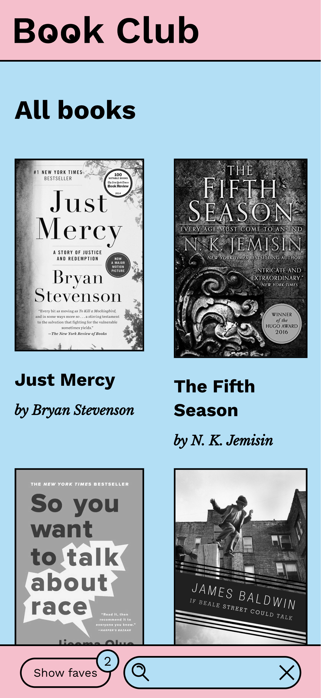
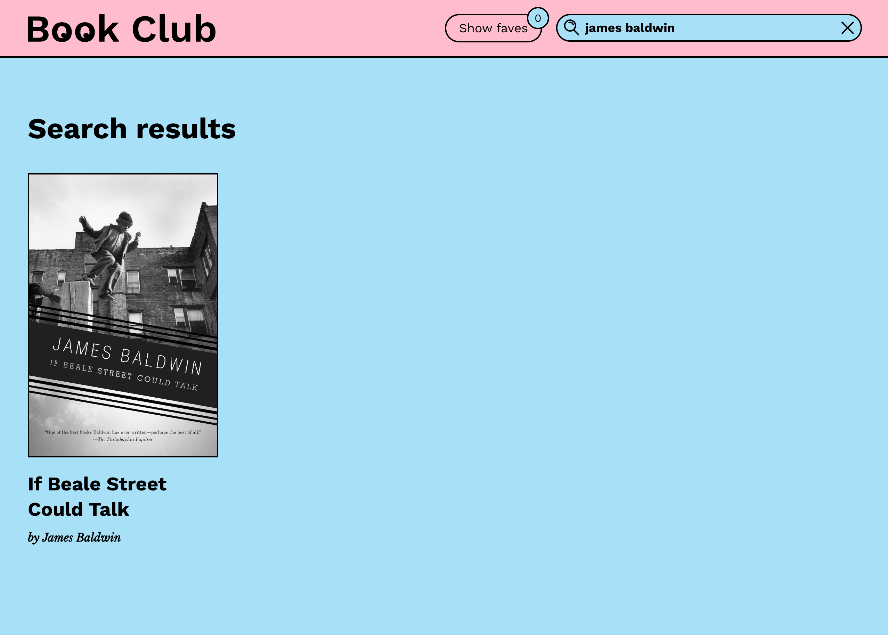
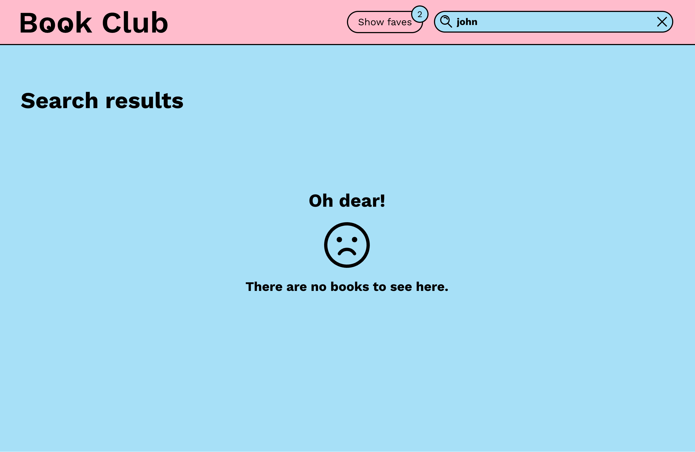
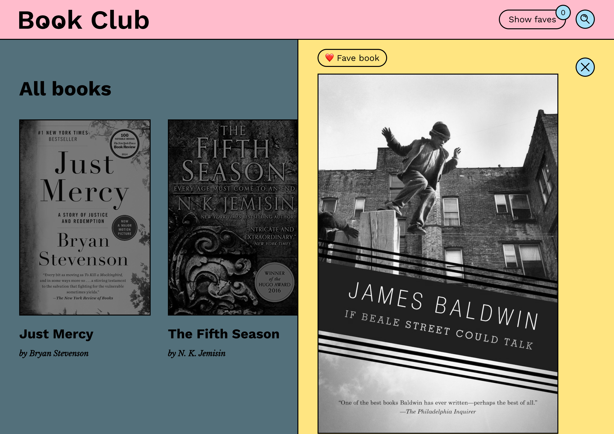
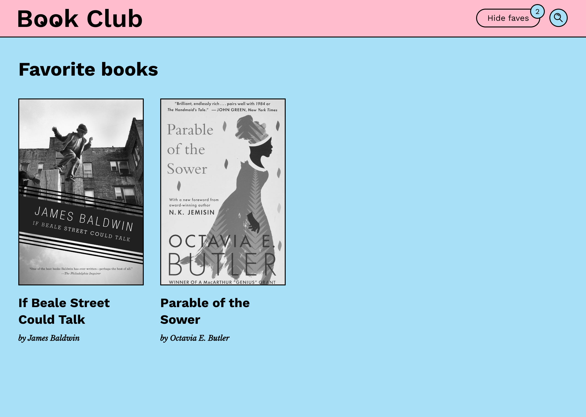
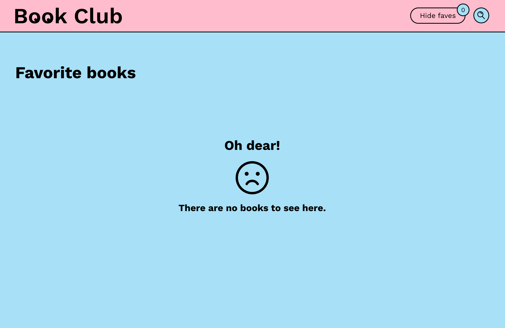

# Book Club App - React

A responsive React application for exploring a curated collection of books. Users can search by title or author, mark favorites, and view detailed information in an animated side panel. The UI is built with styled-components for a modern, mobile-first experience and features smooth transitions with persistent state stored in local storage.

## Project Overview

This single-page React app displays a catalog of books fetched from a remote API and offers a clean interface for discovery and interaction. Users can browse book covers and metadata in a responsive grid, open an animated panel for more details, and curate personal favorites. The layout adapts across screen sizes with fluid transitions and retained preferences across sessions.

## Key Features

### Book Display & Interaction

- Browse a responsive, styled grid of books with cover images and metadata
- Click a book to open a sliding detail panel with full description and publication year
- Mark or unmark books as favorites via a button in the detail panel

### Search Functionality

- Real-time search input with support for both title and author queries
- Responsive behavior: collapses on mobile, expands on click or focus

### Favorites Management

- Mark or unmark books as favorites via a button in the detail panel
- Filter to display only favorite books
- Favorite state is persisted in localStorage

### Responsive Layout & UX

- Mobile-first design using media queries in styled-components
- Smooth transitions and animated panel behavior using react-transition-group
- Consistent styling with styled-components and custom global styles

## Technologies Used

- **React** – Library for building component-based UIs
- **styled-components** – For scoped CSS-in-JS styling
- **react-transition-group** – To manage component transitions and animations
- **Lodash (debounce)** – For scroll performance optimization
- **Fetch API** – For retrieving book data from a remote endpoint
- **LocalStorage** – For persistent favorite book tracking
- **Yarn** – Dependency and script manager

## Screenshots

### Book List (Desktop)


### Book List (Mobile)



### Search Results (Found)



### Search Results (Not Found)



### Book Detail View – Favorite



### Book Detail View – Unfavorite


### Favorites List



### Favorites Empty State



### Interaction Demo


## Getting Started

### 1. Clone the Repository

```bash
git clone https://github.com/JustinaVilcinskaite/book-club-app-react.git
cd book-club-app-react
```

### 2. Install Dependencies

```bash
yarn install
```

### 3. Start the Development Server

```bash
yarn start
```

The app will be available at http://localhost:3000.

## Project Structure

```
book-club-app-react/
├── assets/                   # Custom SVG icons (logo, search, etc.)
│   └── screenshots/          # Screenshots used in README documentation
├── public/                   # Static assets (favicon, HTML)
├── src/
│   ├── components/           # Modular UI components
│   │   ├── Book/             # Book card display
│   │   ├── BooksContainer/   # Book grid with filtering logic
│   │   ├── DetailedPanel/    # Sliding panel for book details
│   │   ├── Header/           # Top navigation bar
│   │   └── Search/           # Search input and favorite filter
│   ├── App.jsx               # Main app component with layout and logic
│   ├── index.js              # React root rendering
│   ├── styles.js             # Global styles, shared button and layout components
├── .gitignore
├── package.json
├── yarn.lock
└── README.md
```
