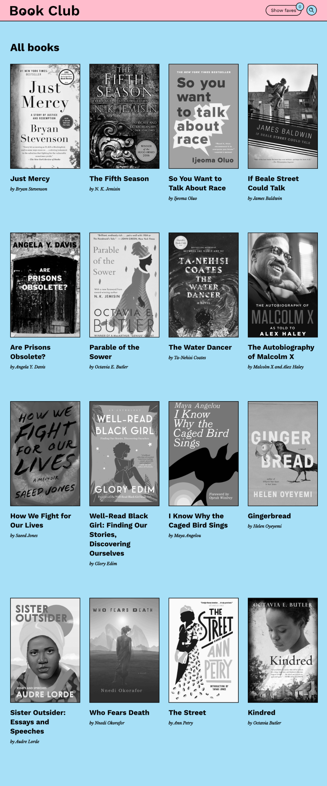
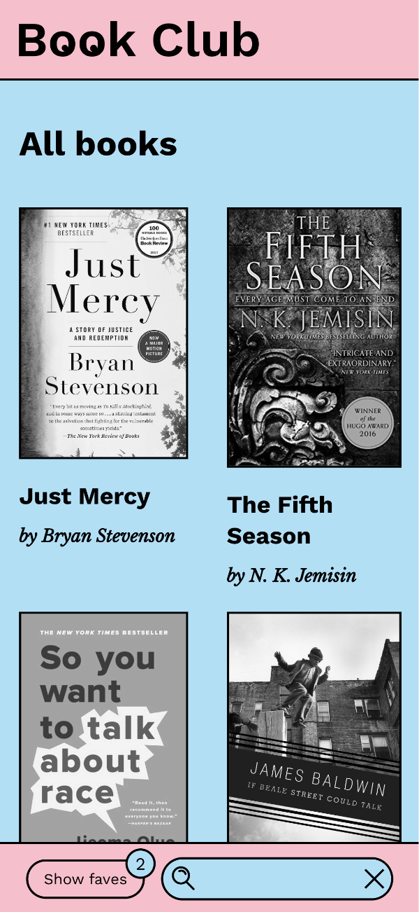
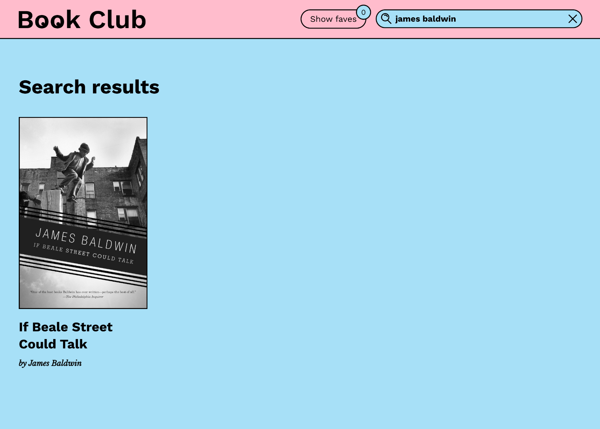
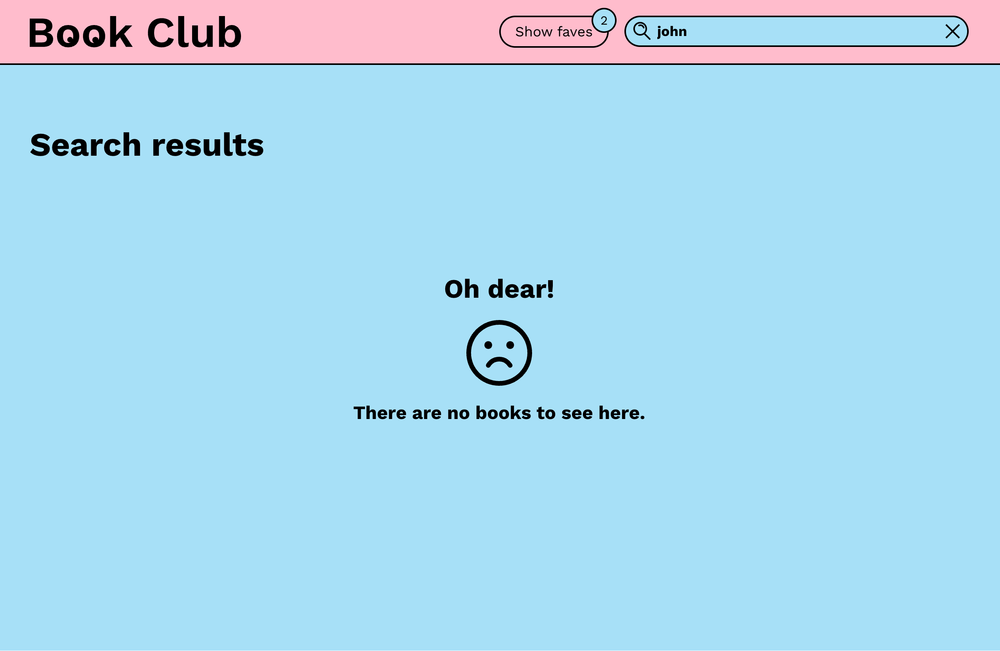
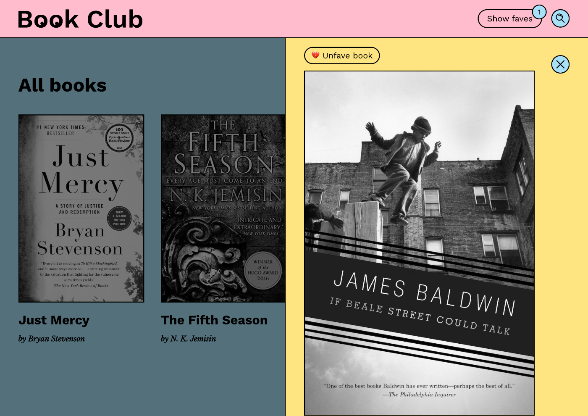
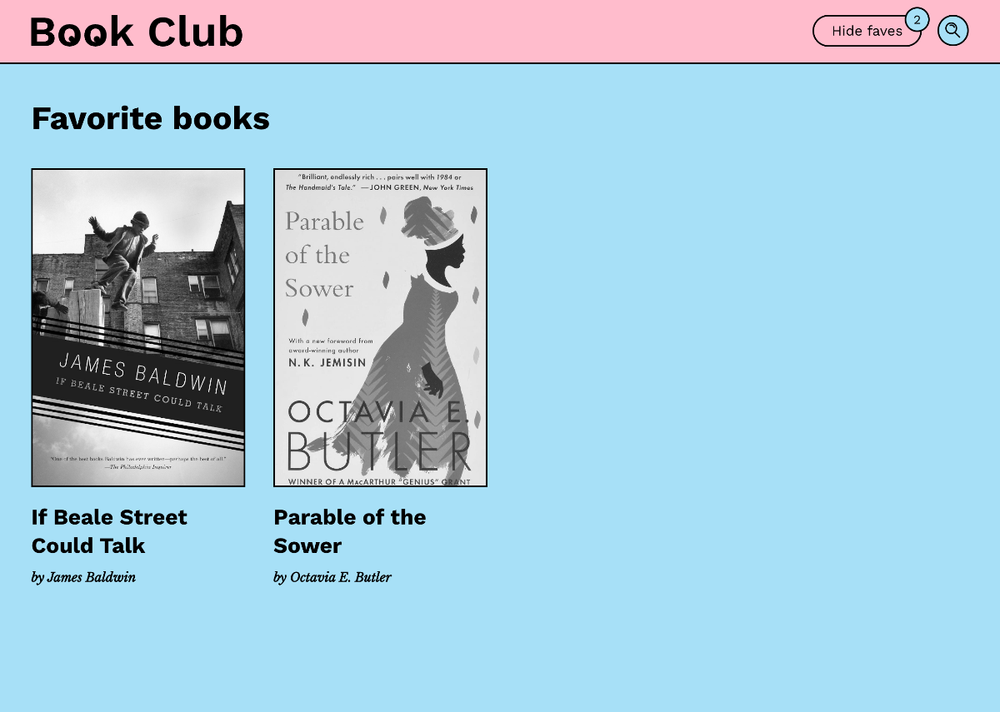
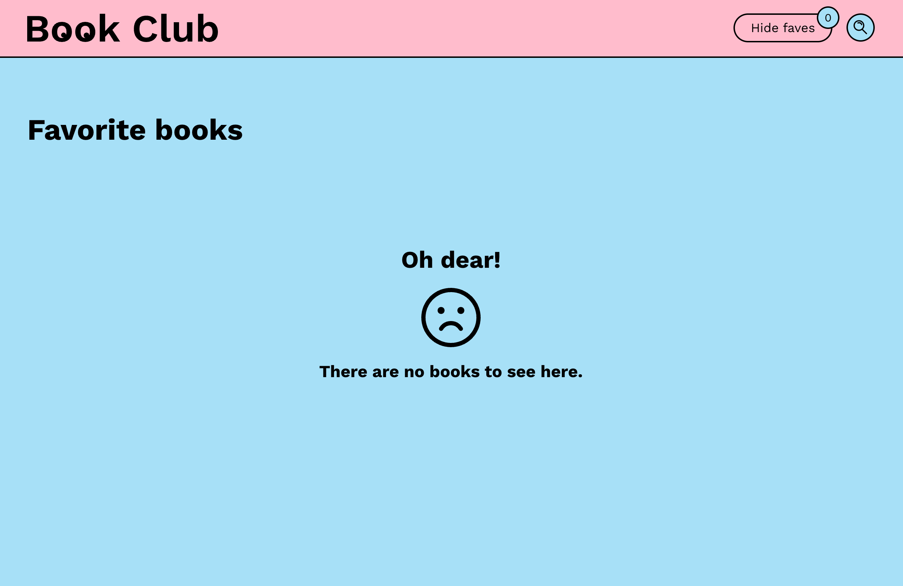

# Book Club App – React

Responsive React app for browsing a book collection fetched from a remote API, searching by title or author, saving favorites, and viewing book details in a sliding detail panel.

The UI is built with styled-components, and favorites are stored in localStorage so they persist between sessions.

## Tech Stack

- React
- JavaScript
- Create React App
- styled-components
- Fetch API
- localStorage
- react-transition-group

## Features

### Book Display & Interaction

- Fetches and displays a collection of books from a remote API
- Responsive book grid with cover images, titles, and authors
- Select a book to open a sliding detail panel with description and publication information

### Search

- Search by book title or author
- Results update as the user types
- Empty state shown when there are no books to display

### Favorites Management

- Add and remove favorite books from the detail panel
- Filter to display only favorite books
- Favorites persist between sessions using localStorage

### Responsive UI & Interaction

- Responsive layout built with styled-components
- Smooth detail panel transitions using react-transition-group
- Scroll position is preserved when opening and closing the detail panel

## Screenshots

### Book List – Desktop



### Book List – Mobile



### Search Results



### Search Empty State



### Book Detail View – Favorited


### Book Detail View – Not Favorited



### Favorites List



### Favorites Empty State



### Interaction Demo


## Getting Started

### 1. Clone the repository

```bash
git clone https://github.com/JustinaVilcinskaite/book-club-app-react.git
cd book-club-app-react
```

### 2. Install dependencies

```bash
yarn install
```

### 3. Run the development server

```bash
yarn start
```

The app will be available at:

```bash
http://localhost:3000
```

## Project Structure

```text
book-club-app-react/
├── docs/
│   └── screenshots/           # README screenshots
├── public/                    # Static public assets
├── src/
│   ├── assets/                # SVG icons and UI assets
│   ├── components/            # Reusable UI components
│   │   ├── Book/              # Book card
│   │   ├── BooksContainer/    # Book grid and empty state
│   │   ├── DetailedPanel/     # Sliding book detail panel
│   │   ├── Header/            # Header and logo
│   │   └── Search/            # Search and favorites filter
│   ├── App.jsx                # Main application component and state logic
│   ├── index.js               # React entry point
│   └── styles.js              # Global styles and shared styled components
├── package.json
├── yarn.lock
└── README.md
```
